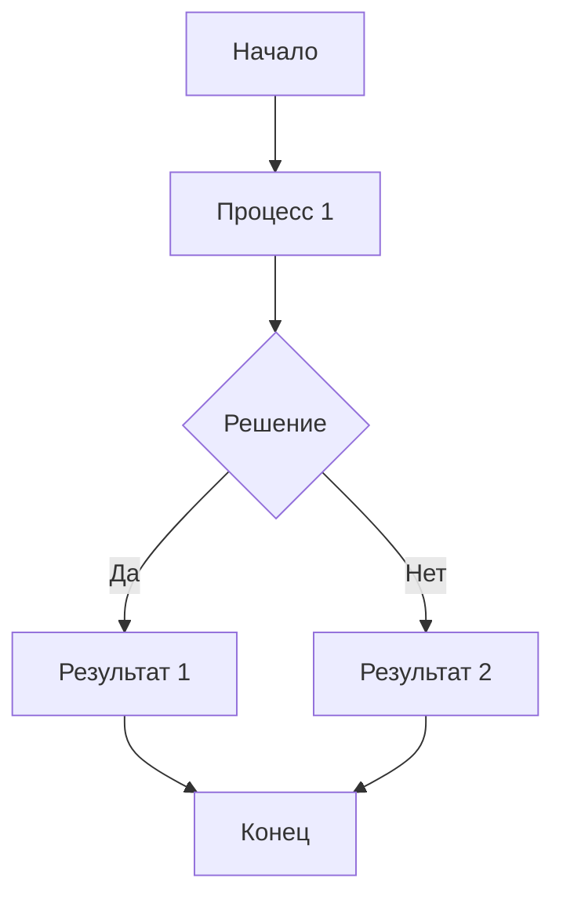

# fugulang

```
Графы описания выражения
```


```mermaid
graph TD
    A[Начало] --> B[Процесс 1]
    B --> C{Решение}
    C -->|Да| D[Результат 1]
    C -->|Нет| E[Результат 2]
    D --> F[Конец]
    E --> F
```
